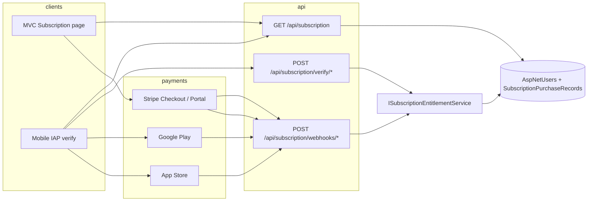

# Subscriptions: shared entitlements (Web + Mobile)

FinanceApp uses **one entitlement record per user** (`ApplicationUser.SubscriptionPlan`, expiry, billing source). Web (Stripe), iOS (App Store), Android (Google Play), and admin tools all call the same `ISubscriptionEntitlementService`.

## Architecture

## Plans and product mapping

| Plan    | Apple product ID (example)              | Google subscription ID | Stripe Price ID (config key)   |
|---------|-----------------------------------------|--------------------------|--------------------------------|
| Free    | —                                       | —                        | —                              |
| Pro     | `com.financeapp.mobile.pro.monthly`     | `pro_monthly`            | `SubscriptionBilling:Stripe:PriceIdToPlan` |
| Premium | `com.financeapp.mobile.premium.monthly` | `premium_monthly`        | same section                   |

Configure in `Shared/appsettings.shared.json` (overridden by user secrets / environment):

- `SubscriptionBilling:AppleProductIdToPlan`
- `SubscriptionBilling:GoogleProductIdToPlan`
- `SubscriptionBilling:Stripe:PriceIdToPlan`

`SubscriptionBillingSource`: `None`, `AdminManual`, `Apple`, `Google`, **`Web`** (Stripe).

## Mobile (IAP)

1. User purchases in-app (StoreKit / Play Billing).
2. App calls `POST /api/subscription/verify/apple` or `verify/google` with signed transaction / purchase token.
3. API verifies with Apple/Google, then `ApplyVerifiedEntitlementAsync`.
4. Store webhooks (`/api/subscription/webhooks/apple|google`) keep status in sync (renewal, revoke).

See `FinanceApp.Mobile/app/(tabs)/subscription.tsx` and `src/api/subscriptionBilling.ts`.

## Web (Stripe)

1. User opens **Subscription** in the MVC app (`/Subscription`).
2. **Upgrade on web** → Stripe Checkout (`SubscriptionController.Checkout`).
3. Stripe sends webhooks to **`POST /api/subscription/webhooks/stripe`** (configure in Stripe Dashboard).
4. Handler maps price → plan and upserts entitlement; `StripeCustomerId` / `StripeSubscriptionId` stored on the user.
5. **Manage billing** → Stripe Customer Portal (`SubscriptionController.ManageBilling`).

Required secrets (never commit real keys):

| Setting | Description |
|---------|-------------|
| `SubscriptionBilling:Stripe:SecretKey` | `sk_test_…` / `sk_live_…` |
| `SubscriptionBilling:Stripe:PublishableKey` | For future Elements (optional) |
| `SubscriptionBilling:Stripe:WebhookSecret` | `whsec_…` from Stripe webhook endpoint |
| `SubscriptionBilling:Stripe:PriceIdToPlan` | Maps Stripe Price IDs → `Pro` / `Premium` |

Webhook events handled: `checkout.session.completed`, `customer.subscription.created|updated`, `customer.subscription.deleted`.

## API surface (both clients)

| Endpoint | Auth | Purpose |
|----------|------|---------|
| `GET /api/subscription` | JWT / cookie session | Current plan (expires sync) |
| `POST /api/subscription/verify/apple` | JWT | Mobile receipt verify |
| `POST /api/subscription/verify/google` | JWT | Mobile receipt verify |
| `POST /api/subscription/webhooks/stripe` | Stripe signature | Web billing lifecycle |
| `POST /api/admin/subscriptions/assign` | Admin | Support / QA |

## Cross-platform rules

- Subscribing on **web** unlocks **Pro/Premium on mobile** after the same user signs in (`GET /api/subscription`).
- Subscribing on **mobile** unlocks the **web** profile the same way.
- Do not stack Apple/Google and Stripe on one account without cancelling the other channel first (UI warns on web checkout).

## Local testing

**Web:** User secrets on `FinanceApp.Web` + `FinanceApp.API` with Stripe test keys; Stripe CLI:  
`stripe listen --forward-to https://localhost:PORT/api/subscription/webhooks/stripe`

**Mobile:** Sandbox Apple/Google accounts; set `SubscriptionBilling:Apple:AllowUnsignedPayloadInDevelopment` only for dev JWS tests.

**Tests:** `dotnet test FinanceApp.API.Tests`
